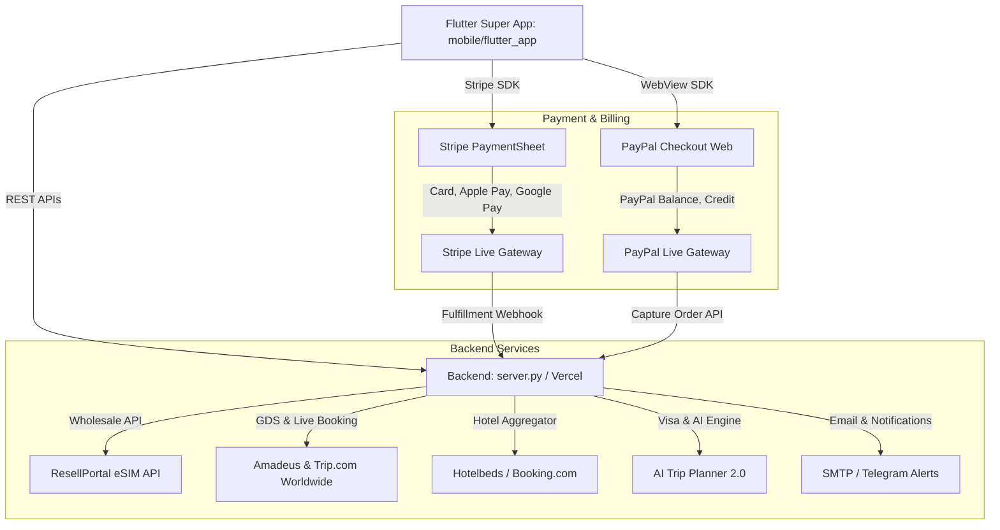

# TravelTrip.World — Flutter Super App & Multi-Service Architecture 🚀

## ১. প্রজেক্ট পরিচিতি (Executive Overview)
**TravelTrip.World** হলো একটি আন্তর্জাতিক মানের **Travel Super App + 5G eSIM Wholesale Marketplace + Flight + Hotel + Visa Processing + AI Trip Planner** সমন্বিত সম্পূর্ণ প্ল্যাটফর্ম।

এই রিপোজিটরিতে মোবাইল ফ্রন্টএন্ডের জন্য একটি পূর্ণাঙ্গ **Flutter Production App (`mobile/flutter_app/`)** এবং ব্যাকএন্ডের জন্য লাইভ **Python Flask / Vercel Serverless Gateway (`server.py`)** সুবিন্যস্তভাবে ইন্টিগ্রেট করা হয়েছে।

---

## ২. আর্কিটেকচার ডায়াগ্রাম (System Architecture)



---

## ৩. Flutter কোডবেস ডিরেক্টরি স্ট্রাকচার

```text
mobile/flutter_app/
├── pubspec.yaml                 # Stripe, WebView, HTTP, UI ডিপেন্ডেন্সি
├── analysis_options.yaml        # লিন্টার রুলস
├── android/
│   └── app/src/main/
│       ├── AndroidManifest.xml  # ইন্টারনেট পারমিশন এবং PayPal DeepLink
│       └── kotlin/.../MainActivity.kt  # FlutterFragmentActivity (Stripe রিকোয়ারমেন্ট)
└── lib/
    ├── main.dart                # অ্যাপ এন্ট্রি পয়েন্ট এবং StripeService ইনিশিয়ালাইজেশন
    ├── constants/
    │   ├── theme.dart           # অফিসিয়াল ব্র্যান্ড কালার (#0B132B, #D4AF37, #FFFFFF, #00C853, #FF5252)
    │   └── config.dart          # Base URL, API Endpoints, Stripe/PayPal Config
    ├── models/
    │   ├── esim_package.dart    # 117+ ResellPortal হোলসেল প্যাকেজ মডেল
    │   ├── flight.dart          # প্রিমিয়ার এয়ারলাইন্স মডেল
    │   └── hotel.dart           # লাক্সারি হোটেল মডেল
    ├── services/
    │   ├── api_service.dart     # লাইভ ব্যাকএন্ড HTTP কানেক্টর
    │   ├── stripe_service.dart  # Native Stripe PaymentSheet সার্ভিস
    │   └── paypal_service.dart  # In-app WebView PayPal সার্ভিস
    └── screens/
        ├── splash_screen.dart   # প্রিমিয়াম ব্র্যান্ডেড স্প্ল্যাশ
        ├── home_screen.dart     # সুপার অ্যাপ ড্যাশবোর্ড ও সার্ভিস গ্রিড
        ├── esim_marketplace_screen.dart # 11+ কান্ট্রির লাইভ ই-সিম স্টোর
        ├── flights_screen.dart  # এমিরেটস, কাতার, সিঙ্গাপুর, বিমান বাংলাদেশ ফ্লাইট
        ├── hotels_screen.dart   # বুর্জ আল আরব, মেরিনা বে স্যান্ডস হোটেলস
        ├── visa_screen.dart     # ইউএই, সৌদি, সেনজেন ভিসা প্রসেসিং
        ├── wallet_screen.dart   # ক্যাশব্যাক (৫%), রিওয়ার্ড পয়েন্ট, রেফারেল বোনাস
        ├── vip_screen.dart      # গোল্ড ও প্ল্যাটিনাম মেম্বারশিপ
        ├── ai_planner_screen.dart # পারসোনালাইজড ট্রাভেল আইটিনেরারি জেনারেটর
        ├── checkout_screen.dart # স্ট্রাইপ ও পেপ্যাল কম্বাইন্ড পেমেন্ট স্ক্রিন
        └── main_navigation_screen.dart # ৯টি সার্ভিসের ফুল বটম নেভিগেশন
```

---

## ৪. ৮-ফেজ ডেভেলপমেন্ট রোডম্যাপ (8-Phase Roadmap)

### Phase 1: Core Setup
* **Frontend**: Flutter 3.x (Dart >= 3.0)
* **Backend**: Python Flask (`server.py`) / Vercel Serverless Functions (`api/index.py`)
* **Payments**: Stripe (`flutter_stripe: ^11.0.0`) & PayPal (`webview_flutter: ^4.8.0`)
* **Cloud & Hosting**: Vercel Live (`https://traveltrip.world`) + Cloudflare SSL

### Phase 2: App Structure & 9-Service Menu
1. 🏠 **Home**: লাইভ সার্ভিস গ্রিড, ওয়ালেট ব্যালেন্স শর্টকাট, লাইভ ফ্লাইট রাডার HUD
2. 🌍 **Explore**: শীর্ষ আন্তর্জাতিক ট্রাভেল ডেস্টিনেশন
3. ✈ **Flights**: এমিরেটস A380, কাতার A350, সিঙ্গাপুর A380, বিমান বাংলাদেশ 787
4. 🏨 **Hotels**: শীর্ষ ৫-স্টার লাক্সারি রিসোর্ট ও হোটেল বুকিং
5. 📶 **eSIM**: ১১৭+ ভেরিফায়েড রিসেলপোর্টাল হোলসেল প্যাকেজ (BD, UAE, IN, QA, OM, PK, EU, GLOBAL, TH, US)
6. 🛂 **Visa**: ইউএই (৩০/৬০ দিন), সৌদি ওমরাহ/ট্যুরিস্ট ভিসা, সেনজেন ভিসা
7. 💳 **Wallet**: ডিজিটাল ওয়ালেট, ৫% ক্যাশব্যাক, রিওয়ার্ড পয়েন্ট, \$১০ রেফারেল বোনাস
8. 👑 **VIP**: গোল্ড (\$৪৯/বছর) এবং প্ল্যাটিনাম এলিট (\$৯৯/বছর) মেম্বারশিপ
9. 👤 **Profile**: ইউজার সেটিংস, অর্ডার হিস্ট্রি, টিকিট ও ইনভয়েস ডাউনলোড

### Phase 3: Travel Services Integration
* **Flights**: Amadeus GDS / Trip.com পার্টনার নেটওয়ার্ক
* **Hotels**: Hotelbeds / Booking Global Direct
* **Tours**: দুবাই ডেজার্ট সাফারি, থাইল্যান্ড আইল্যান্ড হপিং, তুরস্ক বেলুন ট্যুর, সৌদি ভিআইপি ওমরাহ
* **Visa**: অনলাইন ডকুমেন্ট আপলোড ও ২৪-৪৮ ঘণ্টায় ফাস্ট-ট্র্যাক প্রসেসিং

### Phase 4: eSIM System (ResellPortal Wholesale Sync)
* লাইভ ক্যাটালগ সিঙ্ক: `https://traveltrip.world/api/packages`
* অর্ডার সাবমিশনের সাথে সাথে LPA কোড, আইসিসিআইডি (ICCID) এবং QR কোড জেনারেশন
* কাস্টমারের ইমেইলে অটোমেটিক ই-সিম ডেলিভারি

### Phase 5: Payment Flow (Stripe & PayPal)
* **Stripe Flow**:
  1. মোবাইল অ্যাপ কল করে `POST /create-payment-intent`
  2. সার্ভার রিটার্ন করে `{ "clientSecret": "pi_..." }`
  3. `StripeService.makePayment(clientSecret: ...)` নেটিভ পেমেন্ট শিট ওপেন করে
  4. কার্ড, অ্যাপল পে বা গুগল পে ভেরিফিকেশনের পর সাথে সাথে কনফার্মেশন ও ইনভয়েস তৈরি হয়।
* **PayPal Flow**:
  1. মোবাইল অ্যাপ কল করে `POST /create-paypal-order`
  2. সার্ভার রিটার্ন করে `{ "approval_url": "https://paypal.com/..." }`
  3. Flutter WebView-এ পেপ্যাল লগইন ও অর্ডার অ্যাপ্রুভাল হয়
  4. রিটার্ন রিডাইরেক্ট ট্র্যাক করে অর্ডার ডেলিভারি সম্পন্ন হয়।

### Phase 6: Wallet & Cashback Engine
* প্রতি ই-সিমে **৫% ইনস্ট্যান্ট ক্যাশব্যাক**
* প্রতি ফ্লাইট বুকিংয়ে **২% ক্যাশব্যাক**
* প্রতি হোটেল রিজার্ভেশনে **৩% ক্যাশব্যাক**
* প্রতি ফ্রেন্ড রেফারলে **\$১০ ক্যাশ ক্রেডিট**

### Phase 7: VIP Membership
* **Gold Member (\$49/Year)**:
  * অতিরিক্ত ৫% ডিসকাউন্ট
  * ২৪/৭ প্রায়োরিটি হোয়াটসঅ্যাপ ও টেলিগ্রাম সাপোর্ট
  * \$২০ ওয়েলকাম ট্রাভেল ক্রেডিট
* **Platinum Elite (\$99/Year)**:
  * অতিরিক্ত ১০% ডিসকাউন্ট
  * ডেডিকেটেড পারসোনাল ট্রাভেল কনসিয়ার্জ
  * ফ্রি এয়ারপোর্ট লাউঞ্জ পাস ভাউচার
  * কমপ্লিমেন্টারি 5GB গ্লোবাল রোমিং ই-সিম
  * \$৫০ ওয়েলকাম ট্রাভেল ক্রেডিট

### Phase 8: AI Features (Ekram AI 2.0)
* Destination, Duration ও Budget অনুযায়ী মুহূর্তের মধ্যে ডে-বাই-ডে আইটিনেরারি প্ল্যান তৈরি।
* ভ্রমণের দেশ অনুযায়ী সর্বোত্তম 5G ই-সিম প্যাকেজ রেকমেন্ডেশন।

---

## ৫. ব্যাকএন্ড এপিআই রেফারেন্স (Live Backend Contract)

| মেথড | এন্ডপয়েন্ট | বিবরণ |
|---|---|---|
| `POST` | `/create-payment-intent` | স্ট্রাইপ পেমেন্ট ইনটেন্ট তৈরি (রিটার্ন: `clientSecret`) |
| `POST` | `/create-paypal-order` | পেপ্যাল অর্ডার তৈরি (রিটার্ন: `approval_url`, `orderId`) |
| `GET` | `/api/packages?cc=BD` | রিসেলপোর্টাল হোলসেল ই-সিম ক্যাটালগ |
| `GET` | `/api/flights` | প্রিমিয়ার এয়ারলাইন্স ফ্লাইট তালিকা |
| `GET` | `/api/hotels` | কিউরেটেড লাক্সারি হোটেল তালিকা |
| `GET` | `/api/tours` | বেসপোক ট্যুর প্যাকেজসমূহ |
| `GET` | `/api/visa` | আন্তর্জাতিক ভিসা নির্দেশিকা ও রিকোয়ারমেন্টস |
| `GET` | `/api/wallet` | ডিজিটাল ওয়ালেট ব্যালেন্স ও ক্যাশব্যাক স্টেটাস |
| `GET` | `/api/vip` | ভিআইপি গোল্ড ও প্ল্যাটিনাম টায়ারস |
| `POST` | `/api/ai/planner` | এআই ট্রিপ আইটিনেরারি জেনারেটর |

---

## ৬. Flutter অ্যাপ বিল্ড ও রান করার নিয়মাবলী

### প্রয়োজনীয় সফটওয়্যার:
1. Flutter SDK (>= 3.19.0)
2. Android Studio বা VS Code
3. Android SDK (API 34)

### কমান্ডসমূহ:
```bash
# ১. Flutter অ্যাপ ডিরেক্টরিতে যান
cd mobile/flutter_app

# ২. ডিপেন্ডেন্সি ইন্সটল করুন
flutter pub get

# ৩. লোকাল এমুলেটর বা ফোনে রান করুন
flutter run

# ৪. প্রোডাকশন রিলিজ APK বিল্ড করুন (APKPure এবং Uptodown-এর জন্য)
flutter build apk --release

# বিল্ড আউটপুট পাওয়া যাবে:
# build/app/outputs/flutter-apk/app-release.apk
```

---

## ৭. APKPure এবং Uptodown পাবলিশিং গাইড
1. **প্যাকেজ নাম**: `world.traveltrip.traveler`
2. **ভার্সন**: 1.0.0 (Build 1)
3. **APKPure Developer Console**: `https://developer.apkpure.com`
4. **Uptodown Developer Zone**: `https://developers.uptodown.com`
5. **ফিচার গ্রাফিক্স**: সাইটের `images/` ফোল্ডার থেকে এয়ারলাইন্স এবং লোগো গ্রাফিক্স সরাসরি ব্যবহার করা যাবে।
